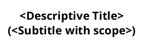

# Generate PlantUML Sequence Diagram

Trace a code flow starting from a given entry point and produce a PlantUML sequence diagram that documents the runtime behavior, annotated with notes highlighting notable callouts or potential improvements.

## Input

The user will provide one or more of:
- A function name or entry point (e.g., `syncStripeStateHandler`, `POST /api/v3/updateSubscription`)
- A file path to start from
- A description of the flow to trace (e.g., "what happens when a Stripe webhook fires")

Optionally, an output file path. If not provided, default to `~/Documents/plans/<descriptive-name>.puml`.

## Instructions

### Phase 1: Trace the flow

1. **Start at the entry point** and read the code. Follow the call chain through each function, noting:
   - Which functions call which (callers → callees)
   - Async boundaries (queues, events, scheduled tasks)
   - External service calls (Stripe API, database reads/writes, cache operations)
   - Conditional branches that meaningfully change the flow
   - Loops or retries

2. **Identify participants.** Each distinct service, module, or external system becomes a participant. Use descriptive names with the role on a second line (e.g., `participant "syncStripeStateHandler\n(Queue Worker)" as sync`).

3. **Trace depth.** Follow calls deep enough to capture all external I/O (API calls, DB reads/writes) but stop before descending into pure utility functions. If a helper just transforms data in memory, summarize it inline rather than adding a participant.

### Phase 2: Annotate

As you trace, watch for and annotate these patterns with PlantUML `note` blocks:

- **Duplicate work** — The same external call or DB query executed multiple times for the same logical operation
- **N+1 patterns** — A call inside a loop that could be batched
- **Unnecessary sequencing** — Steps that could run in parallel but are awaited serially
- **Cache misses after invalidation** — Data invalidated then immediately re-fetched
- **Error handling gaps** — Catch blocks that swallow errors or missing error paths
- **Implicit ordering dependencies** — Steps that must run in a specific order but the code doesn't make this obvious
- **Potential race conditions** — Concurrent operations on shared state without locking
- **Performance observations** — Hot paths, expensive operations, or opportunities to short-circuit

Use colored notes to distinguish:
- `#FFCDD2` (red) for problems or inefficiencies
- `#C8E6C9` (green) for suggested improvements
- `#FFFDE7` (yellow) for informational callouts or context

### Phase 3: Generate the diagram

Produce a `.puml` file following these conventions:

**Participant colors:**
- `#LightBlue` — HTTP entry points, API handlers
- `#LightGreen` — Queue workers, async processors
- `#Orange` — Sync/orchestration functions
- `#Pink` — Data fetching functions
- `#Red` — External API clients (Stripe, etc.)
- `#LightGray` — Database operations
- `#LightYellow` — Lightweight helpers, cache operations

**Structure:**
- Use `== Phase N: Description ==` separators to group logical phases
- Use `ref over` blocks for repeated or notable sub-flows
- Use `activate`/`deactivate` to show function call lifetimes
- Use `alt`/`else`/`end` for meaningful conditional branches
- Use color on `activate` (e.g., `activate stripeFetch #Red`) for external calls

**Summary section:** End with a summary note listing:
- Total external API calls per invocation
- Total DB reads/writes
- Key callouts (numbered, brief)

### Phase 4: Write and confirm

1. Use a bare `@startuml` (no inline title) to avoid PlantUML filename issues.
2. Write the `.puml` file to the output path.
3. Present a brief summary to the user: what the diagram covers, how many participants, and the key callouts found.

## Quality Bar

- Every external I/O operation (API call, DB read, DB write, cache operation) must appear in the diagram
- Notes should be actionable — "this is called twice" is good, "this function exists" is not
- Participants should be traceable back to real files/functions
- The diagram should be renderable by PlantUML without errors
